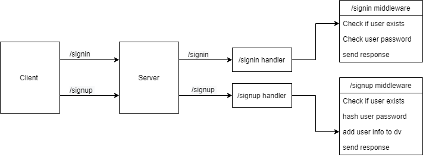

# bearer-auth

## Notes:
- Implemented Express
- Connected Postgres
- Implemented Jest
- Tested before deployment
- Deployed on heroku

### Main Branch
---
### Pull request
---
### Github actions
----
